# Databricks Rust ADBC Driver Design

**Version**: 1.0
**Last Updated**: 2024-12-08
**Author**: PECO Team
**Status**: Draft

---

## 1. Overview

### 1.1 Purpose

This document describes the design of a native Rust ADBC (Arrow Database Connectivity) driver for Databricks SQL Warehouses using the Statement Execution API (SEA). The driver provides Arrow-native access to Databricks, enabling high-performance data access without unnecessary data copies.

### 1.2 Goals

- **Native Rust Implementation**: Pure Rust driver calling SEA REST API directly
- **Arrow-Native**: Return results as Arrow RecordBatches for zero-copy integration
- **High Performance**: Parallel chunk fetching with LZ4 compression support
- **ADBC 1.1.0 Compliant**: Implement all required ADBC traits
- **Async I/O**: Use async runtime internally for efficient network operations

### 1.3 Non-Goals

- OAuth 2.0 authentication (future enhancement)
- Thrift/HiveServer2 protocol support
- Legacy result formats (JSON_ARRAY, CSV)

### 1.4 Key Design Decisions

| Decision | Choice | Rationale |
|----------|--------|-----------|
| Authentication | PAT only | Simplest to implement; OAuth can be added later |
| Result Disposition | INLINE_OR_EXTERNAL_LINKS | Auto-selects optimal mode based on result size |
| Result Format | ARROW_STREAM | Native Arrow format for ADBC |
| Async Runtime | Tokio | Industry standard; sync wrappers for ADBC traits |
| Session Management | Always use sessions | Maintains connection state, enables temp tables |
| Compression | LZ4_FRAME | Reduces network transfer, ~3-5x compression |

---

## 2. Architecture

### 2.1 High-Level Architecture

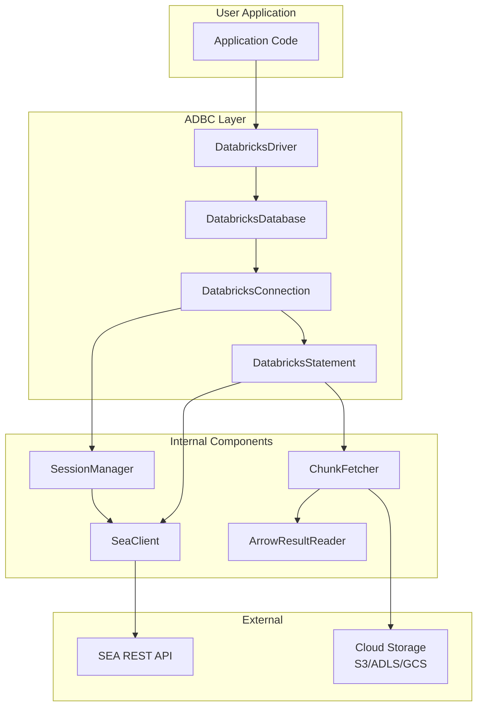

### 2.2 Component Overview

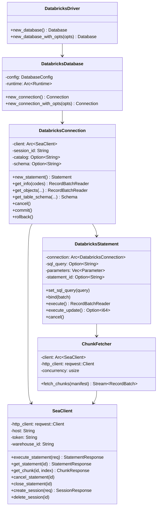

### 2.3 Module Structure

```
adbc-driver-databricks/
├── Cargo.toml
├── src/
│   ├── lib.rs                 # Public exports
│   ├── driver.rs              # DatabricksDriver implementation
│   ├── database.rs            # DatabricksDatabase implementation
│   ├── connection.rs          # DatabricksConnection implementation
│   ├── statement.rs           # DatabricksStatement implementation
│   ├── client/
│   │   ├── mod.rs             # SeaClient
│   │   ├── models.rs          # Request/Response types
│   │   └── error.rs           # API error handling
│   ├── fetch/
│   │   ├── mod.rs             # ChunkFetcher
│   │   ├── reader.rs          # ArrowResultReader
│   │   └── decompress.rs      # LZ4 decompression
│   ├── session.rs             # Session management
│   ├── options.rs             # Driver-specific options
│   └── error.rs               # Error types and mapping
└── tests/
    ├── integration/           # Integration tests
    └── unit/                  # Unit tests
```

---

## 3. Component Design

### 3.1 DatabricksDriver

Entry point for creating database connections.

```rust
pub trait Driver {
    type DatabaseType: Database;

    fn new_database(&mut self) -> Result<Self::DatabaseType>;
    fn new_database_with_opts(
        &mut self,
        opts: impl IntoIterator<Item = (OptionDatabase, OptionValue)>,
    ) -> Result<Self::DatabaseType>;
}
```

**Driver-Specific Options:**

| Option Key | Type | Required | Description |
|------------|------|----------|-------------|
| `uri` | String | Yes | Workspace URL (e.g., `https://xxx.cloud.databricks.com`) |
| `databricks.warehouse_id` | String | Yes | SQL Warehouse ID |
| `databricks.token` | String | Yes | Personal Access Token |
| `databricks.catalog` | String | No | Default catalog |
| `databricks.schema` | String | No | Default schema |

### 3.2 DatabricksDatabase

Holds shared configuration and the Tokio runtime.

```rust
pub struct DatabricksDatabase {
    config: Arc<DatabaseConfig>,
    runtime: Arc<Runtime>,
}

struct DatabaseConfig {
    host: String,
    warehouse_id: String,
    token: String,
    default_catalog: Option<String>,
    default_schema: Option<String>,
    http_config: HttpConfig,
}

struct HttpConfig {
    connect_timeout: Duration,      // Default: 10s
    read_timeout: Duration,         // Default: 300s
    max_retries: u32,               // Default: 3
    retry_backoff_base: Duration,   // Default: 1s
}
```

**Contract:**
- Creating a Database does NOT establish a network connection
- Configuration is validated at Database creation time
- Runtime is shared across all connections from this Database

### 3.3 DatabricksConnection

Represents an active session with the SQL Warehouse.

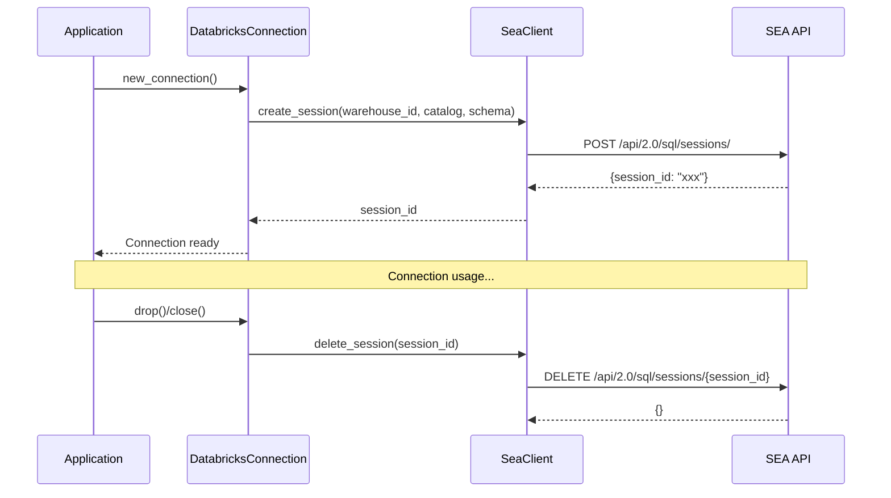

**Session Lifecycle:**
- Session created on `new_connection()`
- Session kept alive automatically (statements refresh the idle timeout)
- Session terminated on Connection drop

**Connection Options:**

| Option Key | Type | Description |
|------------|------|-------------|
| `adbc.connection.autocommit` | String | Always "true" (Databricks doesn't support transactions) |
| `adbc.connection.current_catalog` | String | Current catalog |
| `adbc.connection.current_db_schema` | String | Current schema |

### 3.4 DatabricksStatement

Executes SQL statements and returns results.

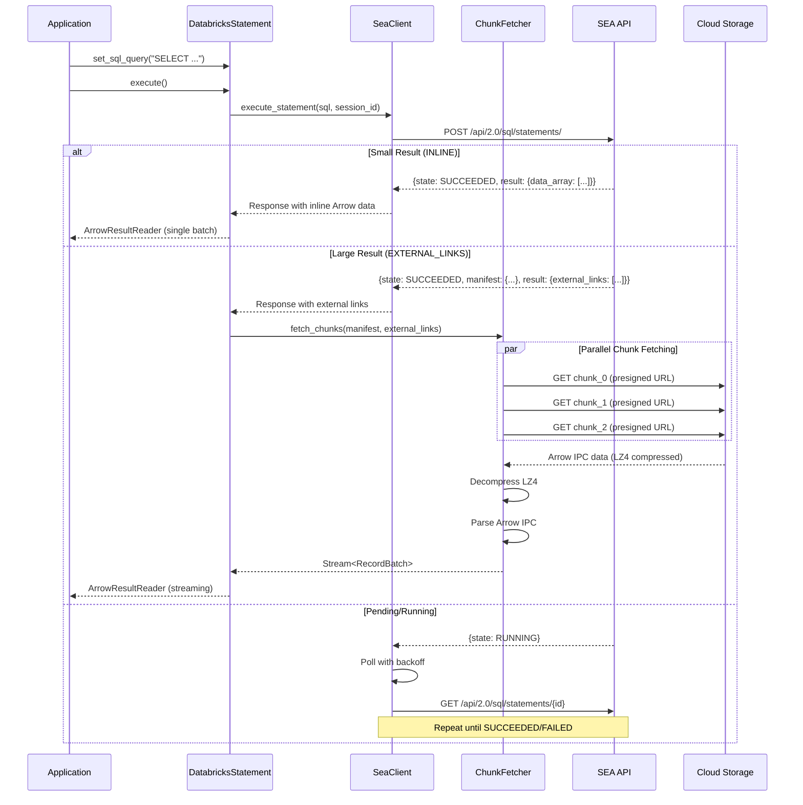

**Statement Options:**

| Option Key | Type | Description |
|------------|------|-------------|
| `databricks.statement.wait_timeout` | String | Wait timeout for initial API call (default: "10s") |
| `databricks.statement.row_limit` | Int | Maximum rows to return |
| `databricks.statement.byte_limit` | Int | Maximum bytes to return |
| `databricks.statement.max_wait` | Int | Maximum wait time in seconds for statement completion (default: 300s) |

### 3.5 ChunkFetcher

Worker pool-based fetcher for EXTERNAL_LINKS chunks using a queue pattern.

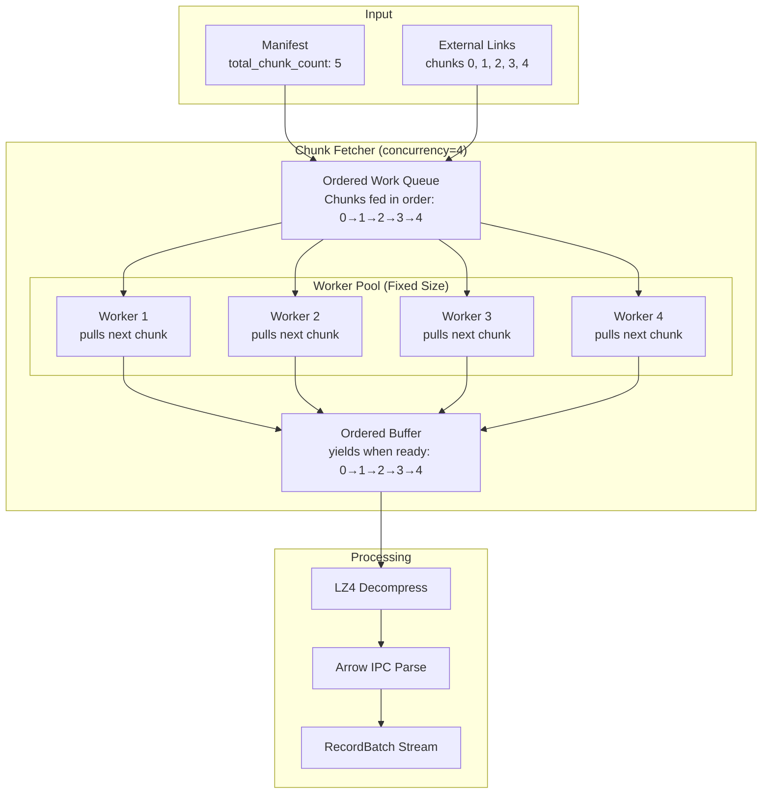

**Architecture:**
- **Worker Pool Pattern**: Fixed number of worker tasks (default: 8) continuously pull from queue
- **Ordered Queue**: Chunks added to queue in sequential order (0, 1, 2, ...)
- **Continuous Processing**: As workers complete downloads, they immediately pull next chunk from queue
- **Ordered Buffer**: Results buffered until ready to yield in sequence

**Ordering Guarantee Despite Variable Download Speeds:**

Workers download at different speeds due to network conditions, chunk sizes, etc. The ordered buffer ensures sequential output:

1. **Tagging**: Each chunk tagged with index when sent to worker: `(chunk_index, external_link)`
2. **Out-of-order completion**: Workers return `(chunk_index, data)` in any order
3. **Buffer storage**: Result stored at `buffer[chunk_index]`
4. **Sequential yielding**: Only yield when `buffer[next_to_yield]` is ready
5. **Cascade yielding**: When blocking chunk arrives, yield all consecutive ready chunks

**Example Timeline:**

```
Completion Order: [2, 0, 3, 1, 4] (out of order due to variable speeds)
Expected Output:  [0, 1, 2, 3, 4] (always in order)

Time │ Event        │ Buffer State              │ next_to_yield │ Action
─────┼──────────────┼───────────────────────────┼───────────────┼─────────────────
  1  │ Chunk 2 done │ [_, _, 2, _, _]           │ 0             │ Buffer, wait
  2  │ Chunk 0 done │ [0, _, 2, _, _]           │ 0             │ Yield 0 → 1
  3  │ Chunk 3 done │ [_, _, 2, 3, _]           │ 1             │ Buffer, wait
  4  │ Chunk 1 done │ [_, 1, 2, 3, _]           │ 1             │ Yield 1,2,3 → 4
  5  │ Chunk 4 done │ [_, _, _, _, 4]           │ 4             │ Yield 4 → 5

Output Stream: 0 → 1 → 2 → 3 → 4 ✓ (Correct order guaranteed!)
```

**Contract:**
- Fixed concurrency: exactly `concurrency` workers active (not all chunks at once)
- Workers continuously pull from ordered queue until exhausted
- **Output RecordBatches yielded in chunk order (0, 1, 2, ...) regardless of completion order**
- Failed chunk downloads retry with exponential backoff
- Expired URLs automatically refreshed by calling `get_chunk` again
- Memory efficient: only buffers out-of-order chunks, not entire result set

**Non-Blocking Architecture:**

Workers are completely decoupled from ordering logic via buffered channels:

```
┌─────────────┐
│ Work Queue  │ → Workers pull chunks (buffered channel)
└─────────────┘
       ↓
┌─────────────┐
│  Worker 1   │ ─┐
│  Worker 2   │  ├─→ Download independently
│  Worker 3   │  │   Each handles own retries/URL refresh
│  Worker 4   │ ─┘   Never wait for each other
└─────────────┘
       ↓
┌─────────────┐
│Result Channel│ → Workers send to buffered channel (non-blocking)
└─────────────┘
       ↓
┌─────────────┐
│Ordered Buffer│ → Separate task, doesn't block workers
└─────────────┘
```

**Critical Properties:**
1. **Workers never blocked by ordering**: Ordering runs in separate task via channels
2. **Workers never blocked by each other**: Each operates independently
3. **URL refresh doesn't block**: Workers continue downloading while one refreshes; refreshed URLs cached and shared via Arc<RwLock<HashMap>>
4. **Channel buffering prevents blocking**: Capacity = num_workers * 2

**Example**: Worker 1 refreshing expired URL → Workers 2, 3, 4 continue downloading unaffected. When Worker 1 gets multiple refreshed URLs back, all are cached. Later, Workers 2-4 check cache first and reuse URLs without additional API calls.

**Benefits:**
- Predictable resource usage with bounded concurrency
- Efficient for large result sets (1000+ chunks)
- Better connection management than spawning all tasks at once
- No blocking between workers, ordering, or URL refresh operations

---

## 4. Data Flow

### 4.1 Execute Query Flow

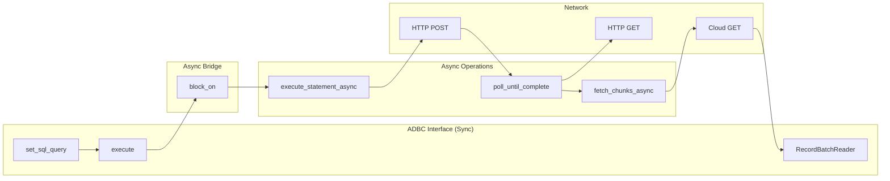

### 4.2 Arrow Type Mapping

| Spark SQL Type | Arrow Type | Notes |
|----------------|------------|-------|
| BOOLEAN | Boolean | |
| TINYINT | Int8 | |
| SMALLINT | Int16 | |
| INT | Int32 | |
| BIGINT | Int64 | |
| FLOAT | Float32 | |
| DOUBLE | Float64 | |
| DECIMAL(p,s) | Decimal128(p,s) | |
| STRING | Utf8 | |
| BINARY | Binary | |
| DATE | Date32 | Days since epoch |
| TIMESTAMP | Timestamp(Microsecond, None) | |
| ARRAY<T> | List<T> | |
| MAP<K,V> | Map<K,V> | |
| STRUCT<...> | Struct<...> | |

---

## 5. Error Handling

### 5.1 Error Mapping

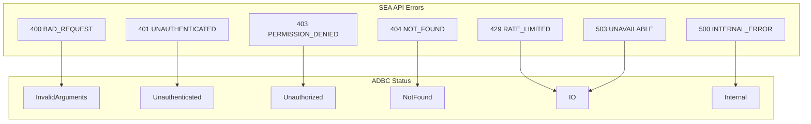

### 5.2 SEA Error to ADBC Status Mapping

| SEA Error Code | HTTP Status | ADBC Status | Retry |
|----------------|-------------|-------------|-------|
| BAD_REQUEST | 400 | InvalidArguments | No |
| INVALID_PARAMETER_VALUE | 400 | InvalidArguments | No |
| UNAUTHENTICATED | 401 | Unauthenticated | Once (refresh) |
| PERMISSION_DENIED | 403 | Unauthorized | No |
| NOT_FOUND | 404 | NotFound | No |
| REQUEST_LIMIT_EXCEEDED | 429 | IO | Yes (backoff) |
| INTERNAL_ERROR | 500 | Internal | Yes (3x) |
| TEMPORARILY_UNAVAILABLE | 503 | IO | Yes (5x) |

### 5.3 Retry Strategy

```rust
/// Retry configuration for transient errors
pub struct RetryConfig {
    /// Maximum retry attempts
    pub max_retries: u32,           // Default: 3
    /// Base delay for exponential backoff
    pub base_delay: Duration,       // Default: 1s
    /// Maximum delay between retries
    pub max_delay: Duration,        // Default: 30s
    /// Jitter factor (0.0 - 1.0)
    pub jitter: f64,                // Default: 0.5
}
```

**Retry Logic:**
- Delay = min(base_delay * 2^attempt, max_delay) * (1 + random(0, jitter))
- 429 errors: Respect `Retry-After` header if present
- Network errors: Retry with backoff
- Statement polling: Exponential backoff (1s, 2s, 4s, 8s, 10s max)

### 5.4 External Link Expiration Handling

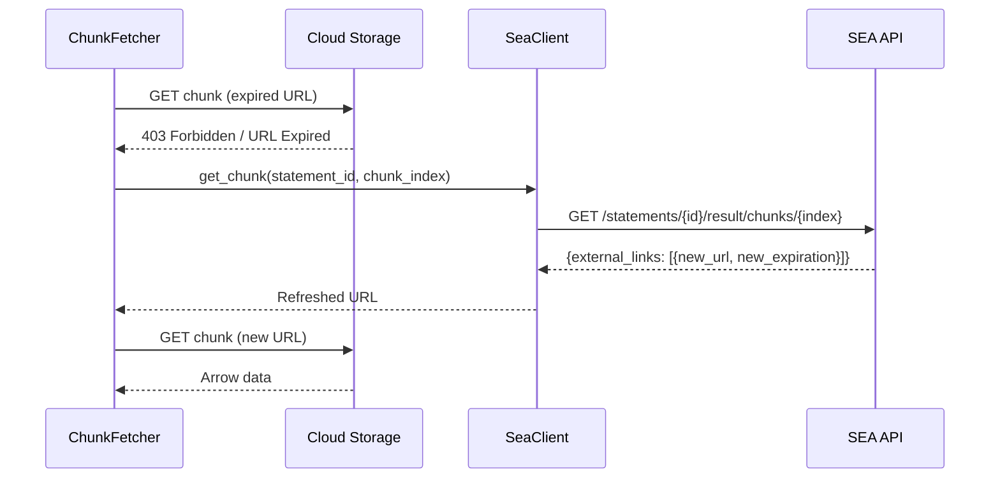

---

## 6. Concurrency Model

### 6.1 Thread Safety

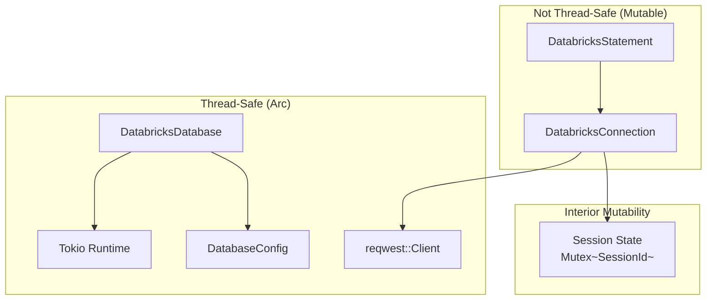

**Thread Safety Guarantees:**
- `DatabricksDatabase`: `Send + Sync` - can be shared across threads
- `DatabricksConnection`: `Send` only - owned by single thread at a time
- `DatabricksStatement`: `Send` only - owned by single thread at a time
- HTTP client: Connection pooled, thread-safe

### 6.2 Async/Sync Bridge

The driver uses async internally (tokio + reqwest) but exposes sync ADBC trait methods.
The `runtime` module provides helper functions for bridging between async and sync contexts.

**Implementation Details:**

The runtime module (`src/runtime.rs`) provides three helper functions:

1. **`block_on_async`**: For operations that return `Result<T>`. Used by execute(), cancel(), etc.
2. **`block_on_async_simple`**: For operations that return plain values (like `is_active()`).
3. **`block_on_async_or_spawn`**: For Drop implementations - blocks in sync context, spawns in async.

```rust
// src/runtime.rs - Async/Sync Bridge Utilities

/// Block on an async operation from a sync context.
/// Note: Will panic if called from within an async task context.
pub fn block_on_async<F, T>(runtime: &Runtime, future: F) -> Result<T>
where
    F: Future<Output = Result<T>>,
{
    runtime.block_on(future)
}

/// Block on async or spawn for Drop implementations.
/// Returns Some(result) in sync context, None if spawned.
pub fn block_on_async_or_spawn<F, T>(runtime: &Arc<Runtime>, future: F) -> Option<Result<T>>
where
    F: Future<Output = Result<T>> + Send + 'static,
    T: Send + 'static,
{
    if tokio::runtime::Handle::try_current().is_ok() {
        // In async context - spawn detached task
        tokio::spawn(async move { let _ = future.await; });
        None
    } else {
        // In sync context - safe to block
        Some(runtime.block_on(future))
    }
}
```

**Usage in Statement:**

```rust
impl Statement for DatabricksStatement {
    fn execute(&mut self) -> Result<impl RecordBatchReader + Send> {
        let sql = self.sql_query.as_ref().ok_or_else(|| /* error */)?;

        // Get session ID using async/sync bridge
        let session_manager = self.session_manager.clone();
        let session_id = block_on_async(&self.runtime, async move {
            session_manager.get_session_id().await
        })?;

        // Execute statement using async/sync bridge
        let client = self.client.clone();
        let response = block_on_async(&self.runtime, async move {
            client.execute_and_wait(&session_id, &sql, ...).await
        })?;

        self.response_to_reader(response)
    }
}
```

**Connection Drop Handling:**

```rust
impl Drop for DatabricksConnection {
    fn drop(&mut self) {
        let session_manager = self.session_manager.clone();

        // Use block_on_async_or_spawn for safe cleanup
        if let Some(result) = block_on_async_or_spawn(&self.runtime, async move {
            session_manager.terminate().await
        }) {
            if let Err(e) = result {
                eprintln!("Failed to terminate session: {}", e);
            }
        }
        // If None, task was spawned asynchronously
    }
}
```

**Important Notes:**

1. **Nested Runtime Detection**: Calling `block_on` from within an async task will panic.
   The driver detects this case in Drop and spawns a detached task instead.

2. **spawn_blocking Compatibility**: Code inside `spawn_blocking` can safely call `block_on`
   because `spawn_blocking` runs on a blocking thread pool, not the async task context.

3. **Testing**: Tests that need to create connections use `spawn_blocking` to run in a
   sync context while still being async test functions.

---

## 7. Configuration

### 7.1 Connection String Format

```
databricks://<host>/<warehouse_id>?token=<pat>&catalog=<catalog>&schema=<schema>
```

Example:
```
databricks://my-workspace.cloud.databricks.com/abc123def456?token=dapi1234567890&catalog=main&schema=default
```

### 7.2 Driver Options Summary

| Option | Scope | Type | Default | Description |
|--------|-------|------|---------|-------------|
| `uri` | Database | String | Required | Workspace URL |
| `databricks.warehouse_id` | Database | String | Required | SQL Warehouse ID |
| `databricks.token` | Database | String | Required | PAT token |
| `databricks.catalog` | Database | String | None | Default catalog |
| `databricks.schema` | Database | String | None | Default schema |
| `databricks.http.connect_timeout` | Database | Int | 10000 | Connect timeout (ms) |
| `databricks.http.read_timeout` | Database | Int | 300000 | Read timeout (ms) |
| `databricks.fetch.concurrency` | Database | Int | 8 | Parallel chunk fetchers |
| `databricks.fetch.compression` | Database | String | "LZ4_FRAME" | Result compression |

### 7.3 Environment Variables

| Variable | Maps To |
|----------|---------|
| `DATABRICKS_HOST` | `uri` |
| `DATABRICKS_WAREHOUSE_ID` | `databricks.warehouse_id` |
| `DATABRICKS_TOKEN` | `databricks.token` |
| `DATABRICKS_CATALOG` | `databricks.catalog` |
| `DATABRICKS_SCHEMA` | `databricks.schema` |

---

## 8. Dependencies

### 8.1 Rust Crates

| Crate | Version | Purpose |
|-------|---------|---------|
| `adbc_core` | latest | ADBC trait definitions |
| `arrow` | ^53.0 | Arrow data types and arrays |
| `arrow-ipc` | ^53.0 | Arrow IPC stream parsing |
| `tokio` | ^1.0 | Async runtime |
| `reqwest` | ^0.12 | HTTP client |
| `serde` | ^1.0 | JSON serialization |
| `serde_json` | ^1.0 | JSON parsing |
| `lz4_flex` | ^0.11 | LZ4 decompression |
| `thiserror` | ^1.0 | Error handling |
| `url` | ^2.0 | URL parsing |
| `base64` | ^0.22 | Base64 encoding |

### 8.2 Cargo.toml Structure

```toml
[package]
name = "adbc-driver-databricks"
version = "0.1.0"
edition = "2021"
license = "Apache-2.0"
description = "ADBC driver for Databricks SQL Warehouses"

[features]
default = ["rustls-tls"]
rustls-tls = ["reqwest/rustls-tls"]
native-tls = ["reqwest/native-tls"]

[dependencies]
adbc_core = { path = "../core" }
arrow = { version = "53", default-features = false }
arrow-ipc = { version = "53" }
arrow-schema = { version = "53" }
arrow-array = { version = "53" }
tokio = { version = "1", features = ["rt-multi-thread", "sync", "time"] }
reqwest = { version = "0.12", default-features = false, features = ["json", "gzip"] }
serde = { version = "1", features = ["derive"] }
serde_json = "1"
lz4_flex = "0.11"
thiserror = "1"
url = "2"
base64 = "0.22"
futures = "0.3"

[dev-dependencies]
tokio-test = "0.4"
wiremock = "0.6"
```

---

## 9. Test Strategy

### 9.1 Unit Tests

| Test Category | Description |
|---------------|-------------|
| `SeaClient_ExecuteStatement_ReturnsStatementId` | Verify execute request/response |
| `SeaClient_Poll_ExponentialBackoff` | Verify polling timing |
| `ChunkFetcher_ParallelFetch_MaintainsOrder` | Verify chunk ordering |
| `ChunkFetcher_ExpiredUrl_RefreshesAndRetries` | Verify URL refresh |
| `ArrowReader_DecompressLz4_ParsesIpc` | Verify decompression + parsing |
| `ErrorMapping_SeaToAdbc_CorrectStatus` | Verify error mapping |
| `Options_ParseConnectionString_ExtractsAll` | Verify option parsing |

### 9.2 Integration Tests

| Test Category | Description |
|---------------|-------------|
| `Connection_OpenClose_CreatesTerminatesSession` | Session lifecycle |
| `Statement_SimpleQuery_ReturnsArrowData` | Basic query execution |
| `Statement_LargeResult_FetchesAllChunks` | Multi-chunk results |
| `Statement_Cancel_StopsExecution` | Cancellation |
| `GetObjects_Catalogs_ReturnsCatalogList` | Metadata queries |
| `GetTableSchema_ValidTable_ReturnsSchema` | Schema retrieval |

### 9.3 Performance Tests

| Test | Target |
|------|--------|
| `Throughput_1GBResult_ParallelFetch` | > 100 MB/s |
| `Latency_SmallQuery_InlineResult` | < 500ms |
| `Concurrency_MultipleStatements_NoContention` | Linear scaling |

### 9.4 E2E Test Strategy

End-to-end tests validate the entire driver stack against a real Databricks SQL Warehouse. These tests ensure that all components work together correctly in production-like scenarios.

#### 9.4.1 Test Infrastructure

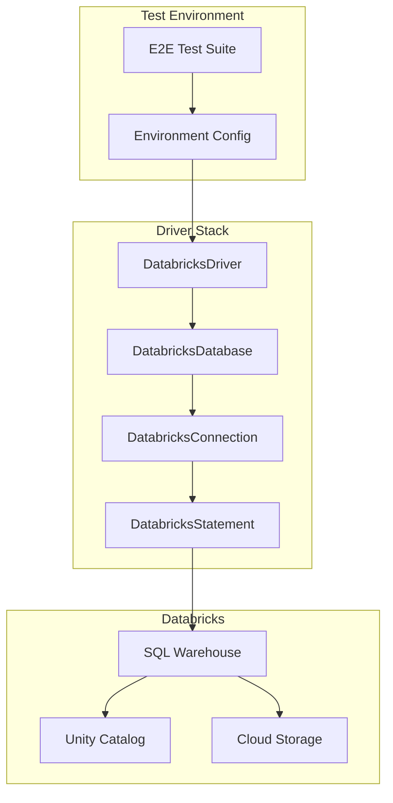

**Test Prerequisites:**
- Live Databricks workspace with Unity Catalog enabled
- SQL Warehouse (Serverless or Classic)
- Personal Access Token with appropriate permissions
- Test catalog and schema (e.g., `main.jade_test`)

**Configuration:**

The Rust driver reuses the existing C# ADBC driver test configuration format for consistency across language implementations. Configuration is loaded from a JSON file specified by the `DATABRICKS_TEST_CONFIG_FILE` environment variable.

**JSON Configuration Format (matches C# driver):**
```json
{
  "environment": "Databricks",
  "uri": "https://benchmarking-prod-aws-us-west-2.cloud.databricks.com/sql/1.0/warehouses/8b699c186a602460",
  "token": "dapi...",
  "query": "select count(*) from `main`.`jade_test`.`product`",
  "type": "databricks",
  "trace": "true",
  "expectedResults": 1,
  "metadata": {
    "catalog": "main",
    "schema": "jade_test",
    "table": "product",
    "expectedColumnCount": 3
  }
}
```

**Rust Configuration Struct:**
```rust
use serde::{Deserialize, Serialize};

/// E2E test configuration matching C# ADBC driver format
/// Loaded from JSON file via DATABRICKS_TEST_CONFIG_FILE environment variable
#[derive(Debug, Clone, Serialize, Deserialize)]
pub struct E2EConfig {
    /// Environment name (e.g., "Databricks")
    pub environment: String,

    /// Full URI including warehouse path
    /// Format: https://{host}/sql/1.0/warehouses/{warehouse_id}
    pub uri: String,

    /// Personal Access Token
    pub token: String,

    /// Optional test query
    #[serde(default)]
    pub query: String,

    /// Driver type (e.g., "databricks")
    #[serde(rename = "type")]
    pub driver_type: String,

    /// Trace logging flag
    #[serde(default)]
    pub trace: String,

    /// Expected number of results for test query
    #[serde(rename = "expectedResults", default)]
    pub expected_results: i64,

    /// Test metadata
    #[serde(default)]
    pub metadata: TestMetadata,
}

#[derive(Debug, Clone, Default, Serialize, Deserialize)]
pub struct TestMetadata {
    /// Catalog name for tests
    pub catalog: String,

    /// Schema name for tests
    pub schema: String,

    /// Table name for tests
    pub table: String,

    /// Expected column count for metadata tests
    #[serde(rename = "expectedColumnCount", default)]
    pub expected_column_count: i32,
}

impl E2EConfig {
    /// Load configuration from file specified by DATABRICKS_TEST_CONFIG_FILE
    pub fn from_env() -> Result<Self, Box<dyn std::error::Error>> {
        let config_path = std::env::var("DATABRICKS_TEST_CONFIG_FILE")?;
        let content = std::fs::read_to_string(config_path)?;
        let config: E2EConfig = serde_json::from_str(&content)?;
        Ok(config)
    }

    /// Parse host and warehouse_id from uri
    pub fn parse_uri(&self) -> Result<(String, String), Box<dyn std::error::Error>> {
        // Parse: https://{host}/sql/1.0/warehouses/{warehouse_id}
        let url = url::Url::parse(&self.uri)?;
        let host = url.host_str().ok_or("No host in URI")?.to_string();
        let warehouse_id = url.path_segments()
            .and_then(|segments| segments.last())
            .ok_or("No warehouse_id in URI")?
            .to_string();
        Ok((format!("https://{}", host), warehouse_id))
    }
}
```

#### 9.4.2 E2E Test Categories

##### Connection Lifecycle Tests

| Test Name | Description | Validation |
|-----------|-------------|------------|
| `e2e_connection_open_creates_session` | Open connection creates session in warehouse | Session ID returned, session active |
| `e2e_connection_close_terminates_session` | Close connection terminates session | Session no longer active |
| `e2e_connection_set_catalog_changes_context` | Set catalog option changes active catalog | Queries run in correct catalog |
| `e2e_connection_set_schema_changes_context` | Set schema option changes active schema | Queries run in correct schema |
| `e2e_connection_timeout_handles_gracefully` | Connection timeout handled correctly | Appropriate error returned |

##### Basic Query Execution Tests

| Test Name | Description | Validation |
|-----------|-------------|------------|
| `e2e_query_select_one_returns_result` | Execute `SELECT 1` | Single row, single column with value 1 |
| `e2e_query_empty_result_returns_schema` | Execute query with 0 rows | Empty RecordBatch with correct schema |
| `e2e_query_null_values_handled` | Query with NULL values | Null bitmaps correctly set |
| `e2e_query_unicode_strings_preserved` | Query with emoji/unicode | Unicode characters preserved |
| `e2e_query_syntax_error_returns_error` | Invalid SQL syntax | ADBC InvalidArguments error |

##### Data Type Coverage Tests

| Test Name | Description | Validation |
|-----------|-------------|------------|
| `e2e_types_numeric_all_sizes` | INT8, INT16, INT32, INT64, FLOAT, DOUBLE | Correct Arrow types and values |
| `e2e_types_decimal_precision_scale` | DECIMAL(10,2), DECIMAL(38,10) | Decimal128 with correct precision |
| `e2e_types_string_binary` | STRING, BINARY | Utf8 and Binary arrays |
| `e2e_types_temporal` | DATE, TIMESTAMP, TIMESTAMP_NTZ | Correct Arrow temporal types |
| `e2e_types_complex_array` | ARRAY<INT>, ARRAY<STRING> | ListArray with correct children |
| `e2e_types_complex_struct` | STRUCT<a: INT, b: STRING> | StructArray with fields |
| `e2e_types_complex_map` | MAP<STRING, INT> | MapArray with key/value types |

##### Large Result Handling Tests

| Test Name | Description | Validation |
|-----------|-------------|------------|
| `e2e_result_inline_small_query` | Query < 16MB result | INLINE disposition, single batch |
| `e2e_result_external_large_query` | Query > 16MB result | EXTERNAL_LINKS, multiple chunks |
| `e2e_result_external_parallel_fetch` | Large result with 10+ chunks | Chunks fetched in parallel, ordered |
| `e2e_result_millions_rows` | Query returning 10M rows | All rows retrieved, memory efficient |
| `e2e_result_wide_table` | Query with 1000 columns | Schema and data correct |

##### Compression Tests

| Test Name | Description | Validation |
|-----------|-------------|------------|
| `e2e_compression_lz4_decompression` | Large result with LZ4_FRAME | Correct decompression, data intact |
| `e2e_compression_none_fallback` | Query with compression=NONE | Uncompressed data handled |

##### Metadata Query Tests

| Test Name | Description | Validation |
|-----------|-------------|------------|
| `e2e_metadata_get_info_driver_version` | Get driver info codes | Driver name, version, vendor |
| `e2e_metadata_get_objects_catalogs` | List all catalogs | Correct catalog list |
| `e2e_metadata_get_objects_schemas` | List schemas in catalog | Correct schema list |
| `e2e_metadata_get_objects_tables` | List tables in schema | Correct table list with types |
| `e2e_metadata_get_table_schema` | Get schema for specific table | Arrow schema matches table |
| `e2e_metadata_get_table_types` | Get supported table types | TABLE, VIEW, etc. |

##### Statement Management Tests

| Test Name | Description | Validation |
|-----------|-------------|------------|
| `e2e_statement_reuse_multiple_queries` | Execute multiple queries on same statement | All queries succeed |
| `e2e_statement_cancel_running_query` | Cancel long-running query | Statement cancelled, error returned |
| `e2e_statement_concurrent_statements` | Multiple statements on same connection | All execute independently |
| `e2e_statement_execute_update_insert` | Execute INSERT statement | Row count returned |
| `e2e_statement_execute_update_create_table` | Execute CREATE TABLE | Success, no row count |

##### Error Handling Tests

| Test Name | Description | Validation |
|-----------|-------------|------------|
| `e2e_error_invalid_warehouse_id` | Connect with invalid warehouse | Appropriate ADBC error |
| `e2e_error_invalid_token` | Connect with invalid token | Unauthenticated error |
| `e2e_error_insufficient_permissions` | Query restricted table | Unauthorized error |
| `e2e_error_table_not_found` | Query non-existent table | NotFound error |
| `e2e_error_network_timeout` | Simulate network timeout | IO error with retry |
| `e2e_error_expired_url_refresh` | Delayed chunk fetch with expiration | URL refreshed, data retrieved |

##### Session Management Tests

| Test Name | Description | Validation |
|-----------|-------------|------------|
| `e2e_session_temp_table_isolated` | Create temp table, query in same session | Temp table accessible |
| `e2e_session_temp_table_not_shared` | Create temp table, new connection | Temp table not visible |
| `e2e_session_use_catalog_persists` | USE CATALOG in statement | Subsequent queries use catalog |
| `e2e_session_use_schema_persists` | USE SCHEMA in statement | Subsequent queries use schema |

##### Parameterized Query Tests (Phase 2)

| Test Name | Description | Validation |
|-----------|-------------|------------|
| `e2e_params_bind_scalar_values` | Bind scalar parameters | Parameters substituted correctly |
| `e2e_params_bind_arrow_batch` | Bind RecordBatch | Batch uploaded, query uses values |
| `e2e_params_prepared_statement_reuse` | Prepare and execute multiple times | Efficient reuse |

#### 9.4.3 E2E Test Implementation Pattern

```rust
#[cfg(test)]
mod e2e_tests {
    use super::*;
    use adbc_core::{Driver, Database, Connection, Statement};
    use once_cell::sync::Lazy;
    use std::sync::Mutex;

    /// Lazy-loaded test configuration from JSON file
    static TEST_CONFIG: Lazy<Mutex<Option<E2EConfig>>> = Lazy::new(|| {
        Mutex::new(E2EConfig::from_env().ok())
    });

    /// Check if E2E tests can execute
    pub fn can_execute_test_config() -> bool {
        std::env::var("DATABRICKS_TEST_CONFIG_FILE")
            .map(|path| std::path::Path::new(&path).exists())
            .unwrap_or(false)
    }

    /// Get test configuration or panic with helpful message
    pub fn get_test_config() -> E2EConfig {
        TEST_CONFIG.lock().unwrap()
            .clone()
            .expect(
                "Cannot load test configuration from DATABRICKS_TEST_CONFIG_FILE. \
                 Set this environment variable to point to a valid JSON configuration file."
            )
    }

    /// Macro for conditional test execution
    #[macro_export]
    macro_rules! skip_if_no_config {
        () => {
            if !can_execute_test_config() {
                println!("Skipping test: DATABRICKS_TEST_CONFIG_FILE not set or file not found");
                return;
            }
        };
    }

    /// Create test connection with proper cleanup
    fn create_test_connection() -> Result<impl Connection> {
        let config = get_test_config();
        let (host, warehouse_id) = config.parse_uri()?;

        let mut driver = DatabricksDriver::new();
        let mut db = driver.new_database_with_opts([
            (OptionDatabase::Uri, host.into()),
            (OptionDatabase::Other("warehouse_id".into()), warehouse_id.into()),
            (OptionDatabase::Password, config.token.into()),
        ])?;
        db.new_connection()
    }

    #[test]
    #[ignore] // Run only with --ignored flag
    fn e2e_query_select_one_returns_result() -> Result<()> {
        skip_if_no_config!();

        let mut conn = create_test_connection()?;
        let mut stmt = conn.new_statement()?;

        stmt.set_sql_query("SELECT 1 AS one")?;
        let mut reader = stmt.execute()?;

        // Read first batch
        let batch = reader.next()
            .expect("Expected at least one batch")
            .expect("Failed to read batch");

        // Validate schema
        assert_eq!(batch.schema().fields().len(), 1);
        assert_eq!(batch.schema().field(0).name(), "one");

        // Validate data
        assert_eq!(batch.num_rows(), 1);
        let array = batch.column(0)
            .as_any()
            .downcast_ref::<Int32Array>()
            .expect("Expected Int32Array");
        assert_eq!(array.value(0), 1);

        Ok(())
    }

    #[test]
    #[ignore]
    fn e2e_result_external_large_query() -> Result<()> {
        let mut conn = create_test_connection()?;
        let mut stmt = conn.new_statement()?;

        // Generate large result (>16MB to trigger EXTERNAL_LINKS)
        stmt.set_sql_query(
            "SELECT
                id,
                CONCAT('row_', CAST(id AS STRING)) AS text,
                RAND() AS random_value
            FROM RANGE(0, 1000000)"
        )?;

        let mut reader = stmt.execute()?;

        let mut total_rows = 0;
        while let Some(batch) = reader.next().transpose()? {
            total_rows += batch.num_rows();

            // Validate each batch has correct schema
            assert_eq!(batch.schema().fields().len(), 3);
        }

        assert_eq!(total_rows, 1000000);
        Ok(())
    }
}
```

#### 9.4.4 Test Data Setup

**Test Catalog/Schema Creation:**
```sql
-- Setup script for E2E tests
CREATE CATALOG IF NOT EXISTS e2e_tests;
CREATE SCHEMA IF NOT EXISTS e2e_tests.rust_adbc_driver;

USE e2e_tests.rust_adbc_driver;

-- Test table with various data types
CREATE TABLE IF NOT EXISTS test_types (
    col_boolean BOOLEAN,
    col_tinyint TINYINT,
    col_smallint SMALLINT,
    col_int INT,
    col_bigint BIGINT,
    col_float FLOAT,
    col_double DOUBLE,
    col_decimal DECIMAL(10,2),
    col_string STRING,
    col_binary BINARY,
    col_date DATE,
    col_timestamp TIMESTAMP,
    col_array ARRAY<INT>,
    col_struct STRUCT<a: INT, b: STRING>,
    col_map MAP<STRING, INT>
);

-- Insert test data
INSERT INTO test_types VALUES (
    true,
    127,
    32767,
    2147483647,
    9223372036854775807,
    3.14,
    2.718281828,
    123.45,
    'Hello, World! 🌍',
    X'DEADBEEF',
    DATE '2024-12-08',
    TIMESTAMP '2024-12-08 12:34:56',
    ARRAY(1, 2, 3),
    STRUCT(42, 'answer'),
    MAP('key1', 100, 'key2', 200)
);
```

#### 9.4.5 CI/CD Integration

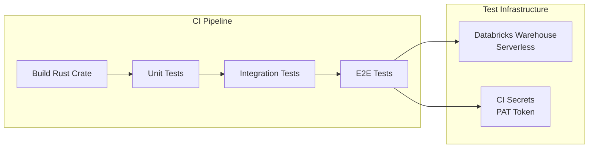

**CI Configuration (GitHub Actions Example):**
```yaml
name: E2E Tests

on:
  push:
    branches: [main]
  pull_request:
    branches: [main]

jobs:
  e2e-tests:
    runs-on: ubuntu-latest

    steps:
      - uses: actions/checkout@v4

      - name: Setup Rust
        uses: actions-rs/toolchain@v1
        with:
          toolchain: stable

      - name: Create test configuration file
        run: |
          cat > /tmp/databricks_test_config.json << EOF
          {
            "environment": "Databricks",
            "uri": "${{ secrets.DATABRICKS_URI }}",
            "token": "${{ secrets.DATABRICKS_TOKEN }}",
            "query": "SELECT 1",
            "type": "databricks",
            "trace": "true",
            "expectedResults": 1,
            "metadata": {
              "catalog": "e2e_tests",
              "schema": "rust_adbc_driver_ci",
              "table": "test_table",
              "expectedColumnCount": 3
            }
          }
          EOF

      - name: Run E2E Tests
        env:
          DATABRICKS_TEST_CONFIG_FILE: /tmp/databricks_test_config.json
        run: |
          cd rust/driver/databricks
          cargo test --release --ignored -- --test-threads=1
```

#### 9.4.6 E2E Test Execution

**Running E2E Tests Locally:**

1. **Create a test configuration file** (e.g., `~/.databricks/test_config.json`):
```json
{
  "environment": "Databricks",
  "uri": "https://my-workspace.cloud.databricks.com/sql/1.0/warehouses/abc123def456",
  "token": "dapi1234567890",
  "query": "select count(*) from `main`.`my_schema`.`my_table`",
  "type": "databricks",
  "trace": "true",
  "expectedResults": 1,
  "metadata": {
    "catalog": "main",
    "schema": "my_schema",
    "table": "my_table",
    "expectedColumnCount": 3
  }
}
```

2. **Set the environment variable and run tests:**
```bash
# Point to your test configuration file
export DATABRICKS_TEST_CONFIG_FILE=~/.databricks/test_config.json

# Run all E2E tests
cd rust/driver/databricks
cargo test --release --ignored

# Run specific E2E test
cargo test --release --ignored e2e_query_select_one_returns_result

# Run with verbose output
cargo test --release --ignored -- --nocapture --test-threads=1
```

**Note:** The configuration file format matches the C# ADBC driver, allowing test configurations to be shared across language implementations.

#### 9.4.7 Test Success Criteria

| Criterion | Requirement |
|-----------|-------------|
| **Pass Rate** | 100% of E2E tests must pass |
| **Coverage** | All ADBC trait methods exercised |
| **Data Types** | All Spark SQL -> Arrow type mappings verified |
| **Result Sizes** | Both INLINE and EXTERNAL_LINKS paths tested |
| **Error Cases** | All error mappings verified with real errors |
| **Performance** | Large result tests complete within reasonable time (< 60s for 10M rows) |

#### 9.4.8 Troubleshooting E2E Test Failures

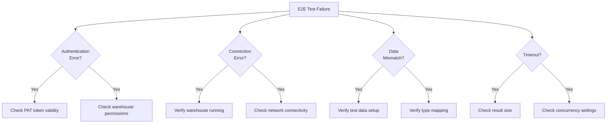

**Common Issues:**
- **Token Expired**: PAT tokens expire; rotate regularly
- **Warehouse Stopped**: Auto-stop disabled warehouses may stop
- **Schema Missing**: Test catalog/schema not created
- **Network Timeout**: Increase timeout for large results
- **Concurrent Access**: Some tests require `--test-threads=1`

---

## 10. Future Enhancements

### Phase 2
- OAuth 2.0 / M2M token authentication
- Token refresh for long-running connections
- Connection pooling

### Phase 3
- Prepared statement caching
- Bulk ingestion support
- Query progress tracking

### Phase 4
- Substrait query support
- Statistics retrieval
- Unity Catalog integration

---

## 11. Appendix

### A. SEA API Reference

Base URL: `https://{workspace-host}/api/2.0/sql/statements`

| Endpoint | Method | Description |
|----------|--------|-------------|
| `/` | POST | Execute statement |
| `/{id}` | GET | Get statement status/result |
| `/{id}/result/chunks/{index}` | GET | Get result chunk |
| `/{id}/cancel` | POST | Cancel statement |
| `/{id}` | DELETE | Close statement |
| `/sessions/` | POST | Create session |
| `/sessions/{id}` | DELETE | Terminate session |

### B. ADBC Trait Implementation Checklist

| Trait | Method | Implementation Status |
|-------|--------|----------------------|
| Driver | `new_database` | Required |
| Driver | `new_database_with_opts` | Required |
| Database | `new_connection` | Required |
| Database | `new_connection_with_opts` | Required |
| Connection | `new_statement` | Required |
| Connection | `cancel` | Required |
| Connection | `get_info` | Required |
| Connection | `get_objects` | Required |
| Connection | `get_table_schema` | Required |
| Connection | `get_table_types` | Required |
| Connection | `commit` | Returns NotImplemented |
| Connection | `rollback` | Returns NotImplemented |
| Statement | `set_sql_query` | Required |
| Statement | `execute` | Required |
| Statement | `execute_update` | Required |
| Statement | `execute_schema` | Required |
| Statement | `cancel` | Required |
| Statement | `bind` | Phase 2 |
| Statement | `prepare` | Phase 2 |
