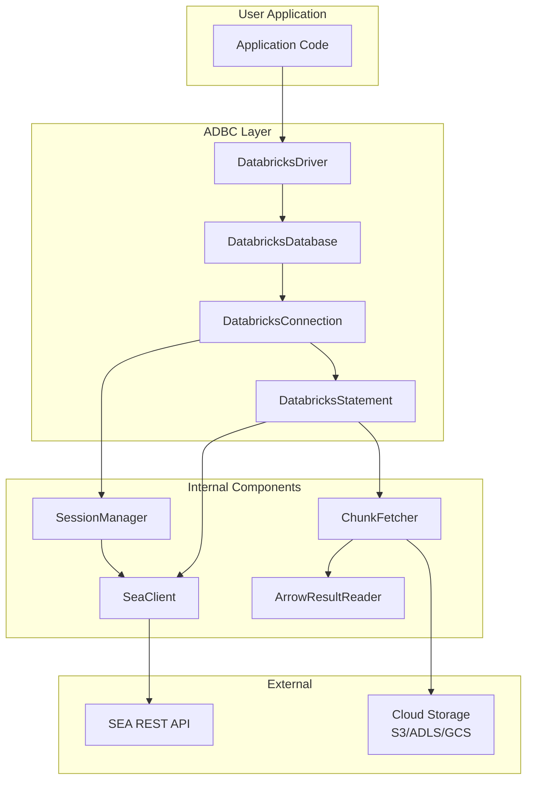
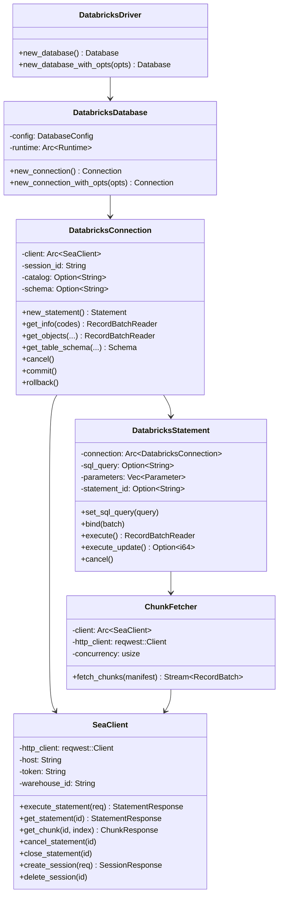
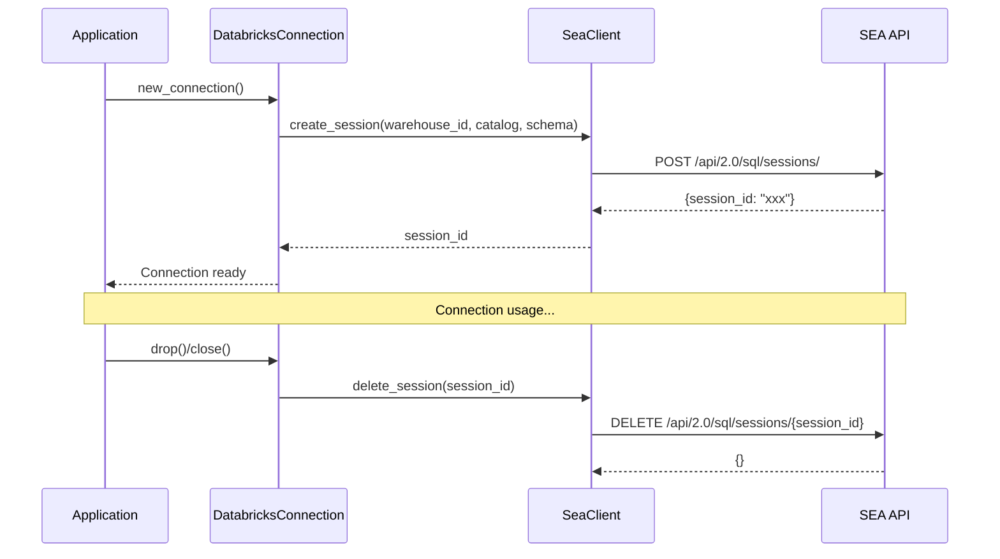
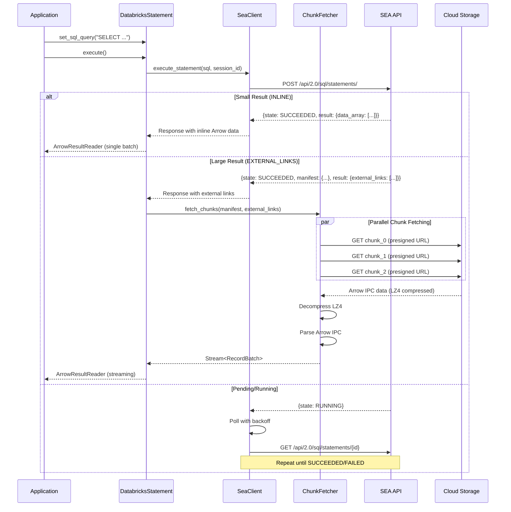
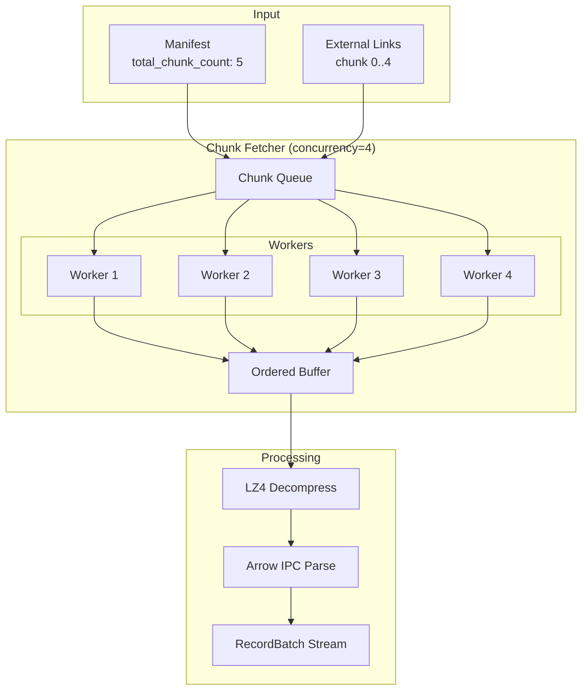
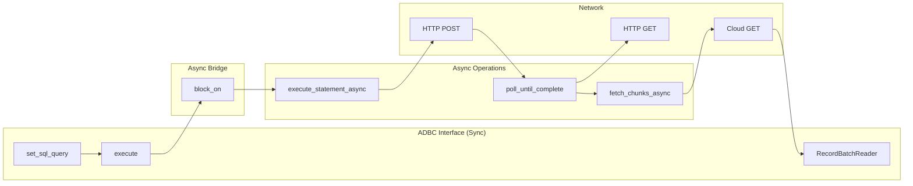
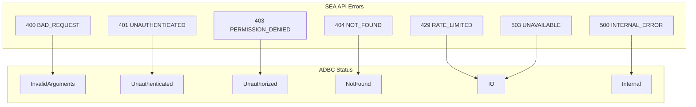
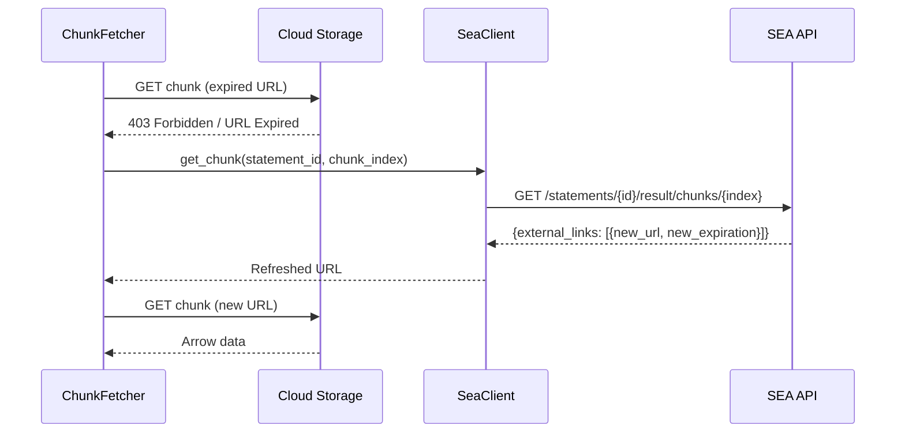
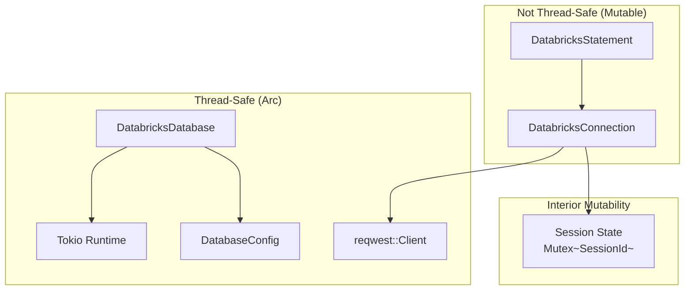

# Databricks Rust ADBC Driver Design

**Version**: 1.0
**Last Updated**: 2024-12-08
**Author**: PECO Team
**Status**: Draft

---

## 1. Overview

### 1.1 Purpose

This document describes the design of a native Rust ADBC (Arrow Database Connectivity) driver for Databricks SQL Warehouses using the Statement Execution API (SEA). The driver provides Arrow-native access to Databricks, enabling high-performance data access without unnecessary data copies.

### 1.2 Goals

- **Native Rust Implementation**: Pure Rust driver calling SEA REST API directly
- **Arrow-Native**: Return results as Arrow RecordBatches for zero-copy integration
- **High Performance**: Parallel chunk fetching with LZ4 compression support
- **ADBC 1.1.0 Compliant**: Implement all required ADBC traits
- **Async I/O**: Use async runtime internally for efficient network operations

### 1.3 Non-Goals

- OAuth 2.0 authentication (future enhancement)
- Thrift/HiveServer2 protocol support
- Legacy result formats (JSON_ARRAY, CSV)

### 1.4 Key Design Decisions

| Decision | Choice | Rationale |
|----------|--------|-----------|
| Authentication | PAT only | Simplest to implement; OAuth can be added later |
| Result Disposition | INLINE_OR_EXTERNAL_LINKS | Auto-selects optimal mode based on result size |
| Result Format | ARROW_STREAM | Native Arrow format for ADBC |
| Async Runtime | Tokio | Industry standard; sync wrappers for ADBC traits |
| Session Management | Always use sessions | Maintains connection state, enables temp tables |
| Compression | LZ4_FRAME | Reduces network transfer, ~3-5x compression |

---

## 2. Architecture

### 2.1 High-Level Architecture



### 2.2 Component Overview



### 2.3 Module Structure

```
adbc-driver-databricks/
├── Cargo.toml
├── src/
│   ├── lib.rs                 # Public exports
│   ├── driver.rs              # DatabricksDriver implementation
│   ├── database.rs            # DatabricksDatabase implementation
│   ├── connection.rs          # DatabricksConnection implementation
│   ├── statement.rs           # DatabricksStatement implementation
│   ├── client/
│   │   ├── mod.rs             # SeaClient
│   │   ├── models.rs          # Request/Response types
│   │   └── error.rs           # API error handling
│   ├── fetch/
│   │   ├── mod.rs             # ChunkFetcher
│   │   ├── reader.rs          # ArrowResultReader
│   │   └── decompress.rs      # LZ4 decompression
│   ├── session.rs             # Session management
│   ├── options.rs             # Driver-specific options
│   └── error.rs               # Error types and mapping
└── tests/
    ├── integration/           # Integration tests
    └── unit/                  # Unit tests
```

---

## 3. Component Design

### 3.1 DatabricksDriver

Entry point for creating database connections.

```rust
pub trait Driver {
    type DatabaseType: Database;

    fn new_database(&mut self) -> Result<Self::DatabaseType>;
    fn new_database_with_opts(
        &mut self,
        opts: impl IntoIterator<Item = (OptionDatabase, OptionValue)>,
    ) -> Result<Self::DatabaseType>;
}
```

**Driver-Specific Options:**

| Option Key | Type | Required | Description |
|------------|------|----------|-------------|
| `uri` | String | Yes | Workspace URL (e.g., `https://xxx.cloud.databricks.com`) |
| `databricks.warehouse_id` | String | Yes | SQL Warehouse ID |
| `databricks.token` | String | Yes | Personal Access Token |
| `databricks.catalog` | String | No | Default catalog |
| `databricks.schema` | String | No | Default schema |

### 3.2 DatabricksDatabase

Holds shared configuration and the Tokio runtime.

```rust
pub struct DatabricksDatabase {
    config: Arc<DatabaseConfig>,
    runtime: Arc<Runtime>,
}

struct DatabaseConfig {
    host: String,
    warehouse_id: String,
    token: String,
    default_catalog: Option<String>,
    default_schema: Option<String>,
    http_config: HttpConfig,
}

struct HttpConfig {
    connect_timeout: Duration,      // Default: 10s
    read_timeout: Duration,         // Default: 300s
    max_retries: u32,               // Default: 3
    retry_backoff_base: Duration,   // Default: 1s
}
```

**Contract:**
- Creating a Database does NOT establish a network connection
- Configuration is validated at Database creation time
- Runtime is shared across all connections from this Database

### 3.3 DatabricksConnection

Represents an active session with the SQL Warehouse.



**Session Lifecycle:**
- Session created on `new_connection()`
- Session kept alive automatically (statements refresh the idle timeout)
- Session terminated on Connection drop

**Connection Options:**

| Option Key | Type | Description |
|------------|------|-------------|
| `adbc.connection.autocommit` | String | Always "true" (Databricks doesn't support transactions) |
| `adbc.connection.current_catalog` | String | Current catalog |
| `adbc.connection.current_db_schema` | String | Current schema |

### 3.4 DatabricksStatement

Executes SQL statements and returns results.



**Statement Options:**

| Option Key | Type | Description |
|------------|------|-------------|
| `databricks.statement.wait_timeout` | String | Wait timeout (default: "10s") |
| `databricks.statement.row_limit` | Int | Maximum rows to return |
| `databricks.statement.byte_limit` | Int | Maximum bytes to return |

### 3.5 ChunkFetcher

Parallel fetcher for EXTERNAL_LINKS chunks.



**Contract:**
- Chunks fetched in parallel with configurable concurrency (default: 8)
- Output RecordBatches are yielded in chunk order
- Failed chunk downloads retry with exponential backoff
- Expired URLs are refreshed by calling `get_chunk` again

---

## 4. Data Flow

### 4.1 Execute Query Flow



### 4.2 Arrow Type Mapping

| Spark SQL Type | Arrow Type | Notes |
|----------------|------------|-------|
| BOOLEAN | Boolean | |
| TINYINT | Int8 | |
| SMALLINT | Int16 | |
| INT | Int32 | |
| BIGINT | Int64 | |
| FLOAT | Float32 | |
| DOUBLE | Float64 | |
| DECIMAL(p,s) | Decimal128(p,s) | |
| STRING | Utf8 | |
| BINARY | Binary | |
| DATE | Date32 | Days since epoch |
| TIMESTAMP | Timestamp(Microsecond, None) | |
| ARRAY<T> | List<T> | |
| MAP<K,V> | Map<K,V> | |
| STRUCT<...> | Struct<...> | |

---

## 5. Error Handling

### 5.1 Error Mapping



### 5.2 SEA Error to ADBC Status Mapping

| SEA Error Code | HTTP Status | ADBC Status | Retry |
|----------------|-------------|-------------|-------|
| BAD_REQUEST | 400 | InvalidArguments | No |
| INVALID_PARAMETER_VALUE | 400 | InvalidArguments | No |
| UNAUTHENTICATED | 401 | Unauthenticated | Once (refresh) |
| PERMISSION_DENIED | 403 | Unauthorized | No |
| NOT_FOUND | 404 | NotFound | No |
| REQUEST_LIMIT_EXCEEDED | 429 | IO | Yes (backoff) |
| INTERNAL_ERROR | 500 | Internal | Yes (3x) |
| TEMPORARILY_UNAVAILABLE | 503 | IO | Yes (5x) |

### 5.3 Retry Strategy

```rust
/// Retry configuration for transient errors
pub struct RetryConfig {
    /// Maximum retry attempts
    pub max_retries: u32,           // Default: 3
    /// Base delay for exponential backoff
    pub base_delay: Duration,       // Default: 1s
    /// Maximum delay between retries
    pub max_delay: Duration,        // Default: 30s
    /// Jitter factor (0.0 - 1.0)
    pub jitter: f64,                // Default: 0.5
}
```

**Retry Logic:**
- Delay = min(base_delay * 2^attempt, max_delay) * (1 + random(0, jitter))
- 429 errors: Respect `Retry-After` header if present
- Network errors: Retry with backoff
- Statement polling: Exponential backoff (1s, 2s, 4s, 8s, 10s max)

### 5.4 External Link Expiration Handling



---

## 6. Concurrency Model

### 6.1 Thread Safety



**Thread Safety Guarantees:**
- `DatabricksDatabase`: `Send + Sync` - can be shared across threads
- `DatabricksConnection`: `Send` only - owned by single thread at a time
- `DatabricksStatement`: `Send` only - owned by single thread at a time
- HTTP client: Connection pooled, thread-safe

### 6.2 Async/Sync Bridge

```rust
impl DatabricksStatement {
    /// Execute query (sync ADBC interface)
    pub fn execute(&mut self) -> Result<impl RecordBatchReader + Send> {
        // Block on async execution within the shared runtime
        self.runtime.block_on(self.execute_async())
    }

    /// Internal async implementation
    async fn execute_async(&mut self) -> Result<ArrowResultReader> {
        let response = self.client.execute_statement(&request).await?;

        match response.status.state {
            State::Succeeded => self.handle_success(response).await,
            State::Pending | State::Running => {
                let final_response = self.poll_until_complete(response.statement_id).await?;
                self.handle_success(final_response).await
            }
            State::Failed => Err(self.map_error(response.status.error)),
            _ => Err(Error::with_message_and_status("Unexpected state", Status::Internal)),
        }
    }
}
```

---

## 7. Configuration

### 7.1 Connection String Format

```
databricks://<host>/<warehouse_id>?token=<pat>&catalog=<catalog>&schema=<schema>
```

Example:
```
databricks://my-workspace.cloud.databricks.com/abc123def456?token=dapi1234567890&catalog=main&schema=default
```

### 7.2 Driver Options Summary

| Option | Scope | Type | Default | Description |
|--------|-------|------|---------|-------------|
| `uri` | Database | String | Required | Workspace URL |
| `databricks.warehouse_id` | Database | String | Required | SQL Warehouse ID |
| `databricks.token` | Database | String | Required | PAT token |
| `databricks.catalog` | Database | String | None | Default catalog |
| `databricks.schema` | Database | String | None | Default schema |
| `databricks.http.connect_timeout` | Database | Int | 10000 | Connect timeout (ms) |
| `databricks.http.read_timeout` | Database | Int | 300000 | Read timeout (ms) |
| `databricks.fetch.concurrency` | Database | Int | 8 | Parallel chunk fetchers |
| `databricks.fetch.compression` | Database | String | "LZ4_FRAME" | Result compression |

### 7.3 Environment Variables

| Variable | Maps To |
|----------|---------|
| `DATABRICKS_HOST` | `uri` |
| `DATABRICKS_WAREHOUSE_ID` | `databricks.warehouse_id` |
| `DATABRICKS_TOKEN` | `databricks.token` |
| `DATABRICKS_CATALOG` | `databricks.catalog` |
| `DATABRICKS_SCHEMA` | `databricks.schema` |

---

## 8. Dependencies

### 8.1 Rust Crates

| Crate | Version | Purpose |
|-------|---------|---------|
| `adbc_core` | latest | ADBC trait definitions |
| `arrow` | ^53.0 | Arrow data types and arrays |
| `arrow-ipc` | ^53.0 | Arrow IPC stream parsing |
| `tokio` | ^1.0 | Async runtime |
| `reqwest` | ^0.12 | HTTP client |
| `serde` | ^1.0 | JSON serialization |
| `serde_json` | ^1.0 | JSON parsing |
| `lz4_flex` | ^0.11 | LZ4 decompression |
| `thiserror` | ^1.0 | Error handling |
| `url` | ^2.0 | URL parsing |
| `base64` | ^0.22 | Base64 encoding |

### 8.2 Cargo.toml Structure

```toml
[package]
name = "adbc-driver-databricks"
version = "0.1.0"
edition = "2021"
license = "Apache-2.0"
description = "ADBC driver for Databricks SQL Warehouses"

[features]
default = ["rustls-tls"]
rustls-tls = ["reqwest/rustls-tls"]
native-tls = ["reqwest/native-tls"]

[dependencies]
adbc_core = { path = "../core" }
arrow = { version = "53", default-features = false }
arrow-ipc = { version = "53" }
arrow-schema = { version = "53" }
arrow-array = { version = "53" }
tokio = { version = "1", features = ["rt-multi-thread", "sync", "time"] }
reqwest = { version = "0.12", default-features = false, features = ["json", "gzip"] }
serde = { version = "1", features = ["derive"] }
serde_json = "1"
lz4_flex = "0.11"
thiserror = "1"
url = "2"
base64 = "0.22"
futures = "0.3"

[dev-dependencies]
tokio-test = "0.4"
wiremock = "0.6"
```

---

## 9. Test Strategy

### 9.1 Unit Tests

| Test Category | Description |
|---------------|-------------|
| `SeaClient_ExecuteStatement_ReturnsStatementId` | Verify execute request/response |
| `SeaClient_Poll_ExponentialBackoff` | Verify polling timing |
| `ChunkFetcher_ParallelFetch_MaintainsOrder` | Verify chunk ordering |
| `ChunkFetcher_ExpiredUrl_RefreshesAndRetries` | Verify URL refresh |
| `ArrowReader_DecompressLz4_ParsesIpc` | Verify decompression + parsing |
| `ErrorMapping_SeaToAdbc_CorrectStatus` | Verify error mapping |
| `Options_ParseConnectionString_ExtractsAll` | Verify option parsing |

### 9.2 Integration Tests

| Test Category | Description |
|---------------|-------------|
| `Connection_OpenClose_CreatesTerminatesSession` | Session lifecycle |
| `Statement_SimpleQuery_ReturnsArrowData` | Basic query execution |
| `Statement_LargeResult_FetchesAllChunks` | Multi-chunk results |
| `Statement_Cancel_StopsExecution` | Cancellation |
| `GetObjects_Catalogs_ReturnsCatalogList` | Metadata queries |
| `GetTableSchema_ValidTable_ReturnsSchema` | Schema retrieval |

### 9.3 Performance Tests

| Test | Target |
|------|--------|
| `Throughput_1GBResult_ParallelFetch` | > 100 MB/s |
| `Latency_SmallQuery_InlineResult` | < 500ms |
| `Concurrency_MultipleStatements_NoContention` | Linear scaling |

---

## 10. Future Enhancements

### Phase 2
- OAuth 2.0 / M2M token authentication
- Token refresh for long-running connections
- Connection pooling

### Phase 3
- Prepared statement caching
- Bulk ingestion support
- Query progress tracking

### Phase 4
- Substrait query support
- Statistics retrieval
- Unity Catalog integration

---

## 11. Appendix

### A. SEA API Reference

Base URL: `https://{workspace-host}/api/2.0/sql/statements`

| Endpoint | Method | Description |
|----------|--------|-------------|
| `/` | POST | Execute statement |
| `/{id}` | GET | Get statement status/result |
| `/{id}/result/chunks/{index}` | GET | Get result chunk |
| `/{id}/cancel` | POST | Cancel statement |
| `/{id}` | DELETE | Close statement |
| `/sessions/` | POST | Create session |
| `/sessions/{id}` | DELETE | Terminate session |

### B. ADBC Trait Implementation Checklist

| Trait | Method | Implementation Status |
|-------|--------|----------------------|
| Driver | `new_database` | Required |
| Driver | `new_database_with_opts` | Required |
| Database | `new_connection` | Required |
| Database | `new_connection_with_opts` | Required |
| Connection | `new_statement` | Required |
| Connection | `cancel` | Required |
| Connection | `get_info` | Required |
| Connection | `get_objects` | Required |
| Connection | `get_table_schema` | Required |
| Connection | `get_table_types` | Required |
| Connection | `commit` | Returns NotImplemented |
| Connection | `rollback` | Returns NotImplemented |
| Statement | `set_sql_query` | Required |
| Statement | `execute` | Required |
| Statement | `execute_update` | Required |
| Statement | `execute_schema` | Required |
| Statement | `cancel` | Required |
| Statement | `bind` | Phase 2 |
| Statement | `prepare` | Phase 2 |
